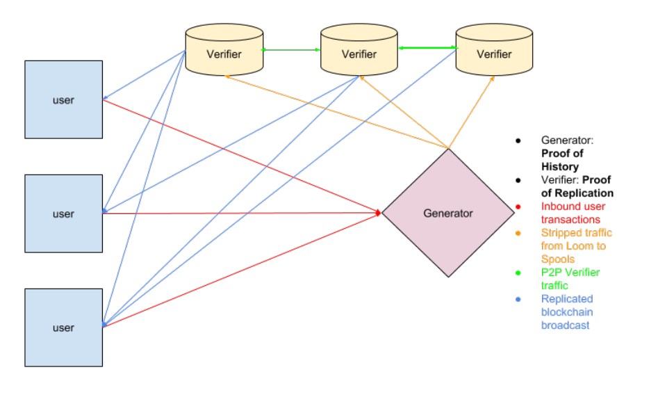
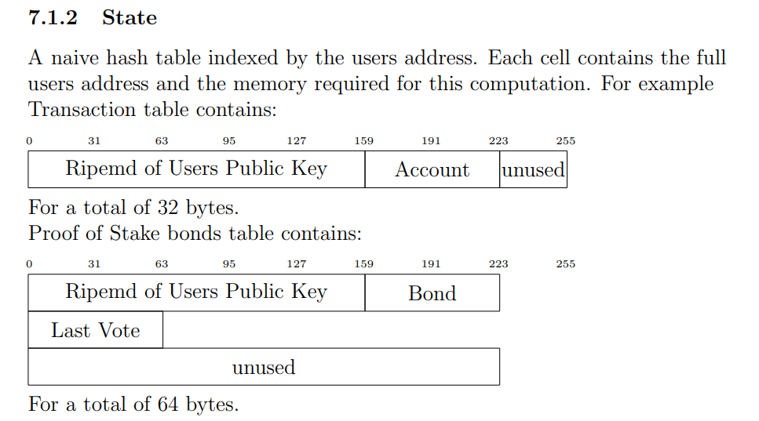

[https://medium.com/@gate_ventures/%E8%AF%A6%E8%A7%A3solana-%E7%9A%84%E6%8A%80%E6%9C%AF%E6%9E%B6%E6%9E%84-%E5%B0%86%E8%A6%81%E8%BF%8E%E6%9D%A5%E7%AC%AC%E4%BA%8C%E6%98%A5%E5%90%97-47a7d7bb64fd]

两个 Worker：Verifier 、 PoH Generate （Leader）

## 组件

### Leader、POH Generator。

1. Leader 就是被选举出来的 POH Generator
2. 它接收用户来的交易，并输出所有交易的 PoH 序列，更改序列保障了 Solana
   系统中的全球一直的顺序
3. 针对一批次的交易，改 Leader 会针对交易顺序运行的结果产生的状态，进行签名发布
4. 该签名是用 Leader 的私钥签的

Verifiers 验证共识

### 状态

1. Solana 系统 状态 由 Hash 表来维护，而且改表是基于用户地址来索引的
2. 表中每个条目包含了用户完整的地址，以及计算要用到的信息
   

#### Verifier，状态复制

原文：The Verifier nodes replicate the blockchain state and provide high availability of the blockchain state. The replication target is selected by the consensus algorithm, and the validators in the consensus algorithm select and vote the Proof of Replication nodes they approve of based on off-chain defined criteria.The network could be configured with a minimum Proof of Stake bond
size, and a requirement for a single replicator identity per bond.

翻译：Verifier 节点复制区块链状态，并提供区块链状态的高可用性。复制目标是由共识算法选择的，而共识算法中的验证者会根据链外定义的标准选择和投票他们认可的 Proof of Replication 节点。网络可以配置一个最低的权益证明（Proof of Stake）保证金大小，以及每个保证金对应一个唯一的复制者身份的要求。
解释

##### Verifier 节点：

这些节点负责复制和维护整个区块链的状态。这意味着它们保存了区块链的所有数据，并在需要时可以提供这些数据的高可用性和快速访问。

##### Proof of Replication（PoRep）：

PoRep 节点通过复制数据来证明其已正确地存储和维护了区块链的数据。验证者节点选择和投票决定哪些 PoRep 节点是可信的，这些决定基于链外（即区块链外部）的某些标准。

##### 共识算法的选择：

共识算法负责决定哪些节点会作为 Verifier 节点来复制区块链状态。验证者节点根据链外标准选择和投票 PoRep 节点，以确保数据的复制和存储是安全且可靠的。

##### 最低权益证明保证金：

网络可能要求参与的节点提供一定数量的保证金（PoS bond），这是权益证明的一部分。这个保证金是为了确保参与者有经济动机去诚实行事。如果参与者行为不当，他们的保证金可能会被没收。

##### 单一复制者身份：

网络可能要求每个保证金（bond）只对应一个唯一的复制者身份。这意味着每个节点只能以唯一的身份参与，避免了同一个实体使用多个身份参与网络的情况，从而提高系统的透明度和安全性。

#### Validators

1. 这些节点是虚拟节点，泡在 Verifiers 或 Leader 所在的机器上，或者独立的机器上
2. 他们专门用来执行 Solana 配置的共识算法
3. 当机器扮演 Leader 角色是，这些 Validators 是不运行的；也就是只有扮演 Verifiers 的角色是，才会运行

### 智能合约 TODO

白皮书上这段描述解释了 Solana 区块链中智能合约的实现方式和架构，特别是其使用**eBPF（Extended Berkeley Packet Filter）**字节码和内在函数（intrinsics）的细节。以下是对这些内容的解释：

#### 智能合约和事务

智能合约是一种广义的事务形式：智能合约是区块链上的程序，它们在每个节点上运行并修改状态。这些合约可以看作是比普通事务更复杂和功能更广泛的操作。

#### 使用 eBPF 字节码

eBPF 字节码：Solana 使用扩展的 Berkeley Packet Filter（eBPF）字节码作为智能合约的实现方式。eBPF 是一种高效、可扩展的字节码格式，最初用于网络数据包过滤。Solana 选择 eBPF 是因为它执行速度快、易于分析，并支持即时编译（JIT）。

#### 内在函数（Intrinsics）

内在函数：这些是直接在平台上实现的函数，可以被智能合约调用。调用内在函数会暂停当前程序，并在高性能服务器上安排这些内在函数的执行。例如，ECDSA 签名验证是一种内在函数。

并行执行：多个用户程序可以调用相同的内在函数。这些调用会被批量处理，并在 GPU 上并行执行。通过这种方式，可以显著提高处理速度，增加数千倍的吞吐量。

#### 运行时环境和 JIT 编译

- 零成本的外部函数接口（FFI）：由于 eBPF 字节码具有明确的上下文和内存使用模型，不需要操作系统线程的上下文切换。这使得调用外部函数（如内在函数）更加高效。

- LLVM 支持：eBPF 已被集成到 LLVM 编译器框架中，自 2015 年以来，任何支持 LLVM 的前端语言都可以用于编写智能合约。这意味着开发者可以使用多种编程语言（如 C、C++等）编写合约，然后编译成 eBPF 字节码。

- 验证和转换：eBPF 字节码可以通过单次检查来验证其正确性，确定其运行时和内存需求，然后转换为 x86 指令。这一过程确保了智能合约的安全性和高效执行。

总结
Solana 的智能合约系统利用了 eBPF 字节码的高效性和可分析性，结合了内在函数的并行执行能力，实现了高吞吐量和快速的事务处理。使用 LLVM 支持的 eBPF 后端，开发者可以用多种语言编写智能合约，这大大增加了开发的灵活性和效率。总的来说，这种设计使 Solana 能够在保持高性能的同时，提供灵活和强大的智能合约功能。
