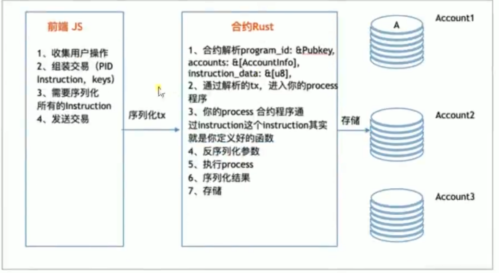
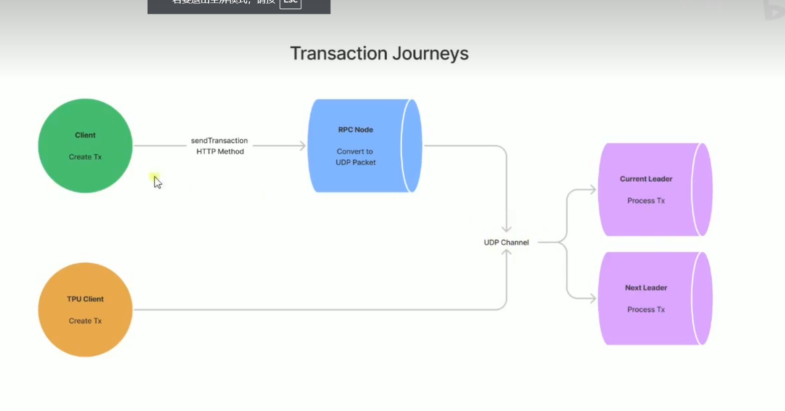

# 程序模型

该模型用来知道 App 或者客户端，如何越 Solana 网络交互

## 主要规则介绍

1. app 可以通过发送 transaction 来与 Solana cluster 交互
2. 一个 transaction 中可以包含一个或者多个 instruction
3. Solana runtime 会将这些 instruction 发送给 app 开发者之前部署的 program
4. instruction 可以是;
   - 告诉链上程序件 lamports 从一个账户转移到另一个账户
     Lamports 是 Solana 网络中最小的货币单位
     1 SOL = 1,000,000,000 (十亿) Lamports
   - 创建一个交互式合约，来长官 lamports 具体是如何转移的
5. 每一个个 transaction 内的 instructions 为顺序原子执行的
6. 若交易中模 instruction 无效，则该正比较以内的所有的 account changes 都将回滚

## 链上程序工作流

solana 的智能合约叫做链上程序，Solana 官网提供给了 Rust 和 C 的 SDK 来支持开发链上程序。开发者可以使用过工具讲过程序编译成 Berkley Packet Filter(BPF)字节码(文件以.so 为扩展名)，在部署到 Sealevel 并行智能合约运行时去执行智能合约逻辑。此外，给予 Solana Json Rpc API 官方听听了诸多 SDK 用于客户端与 Solana 连山数据交互

## 账户模型

与以太坊类似，，Solana 也是基于账户模型的区块了，通过将任意状态存储于链上账户并同步复制给集群中的所有节点，进而可以创建复杂而强大的去中心化应用程序

solana 提供了一套不同于以太坊的账户模型，账户中的字段定义如下表所示。solana 的账户可以分为可执行账户和不可执行账户

- 可执行账户（合约|程序）；存储不可变的数据，主要用于存储程序的 BPF 字节吗
- 不可执行账户：存储可变的数据，主要用于存储程序的状态

### 账户模型字段

#### 主要字段

公钥（Public Key）:

账户的唯一标识符，用于地址和签名验证。
余额（Lamports）:

存储在账户中的 SOL 的数量，以 Lamports 为单位。Lamports 是 SOL 的最小单位。
所有者（Owner）:

负责管理账户的公钥地址。通常情况下，这是部署智能合约的程序的公钥地址。
数据（Data）:

任意二进制数据，可以用于存储与程序相关的状态信息或用户数据。其大小和内容根据具体应用需求而定。
执行状态（Executable）:

一个布尔值字段，指示该账户是否包含可执行的程序代码。如果为 true，则表示该账户是一个程序账户，可以被调用执行代码。
租赁状态（Rent Epoch）:

表示租赁状态的字段。租赁机制确保账户的数据存储持续有效，未支付租赁费用的账户可能会被清除。

#### 衍生字段

这些字段是根据上述主要字段计算或推导出来的：

账户类型:

根据 Executable 字段的值，确定账户是普通账户还是程序账户。
数据大小:

Data 字段的字节大小。
特殊账户类型
除了上述通用字段外，Solana 还支持多种特殊账户类型，这些类型的账户可能包含额外的特定字段：

Token Accounts: 用于持有代币（类似于 ERC-20 代币），可能包含代币数量、代币所有者等信息。
Stake Accounts: 用于参与 PoS 共识，包含质押的 SOL 数量、质押者信息、验证者信息等。
这些字段共同构成了 Solana 账户的基本结构，使其能够存储和管理复杂的数据和状态，同时支持智能合约的执行和区块链上的多种操作。

我们知道以太坊每个智能合约的代码和状态都存储在同一个账户中，而 solana 链上程序是只读或无状态的，即程序的账户(可执行账户)只存储 BPF 字节码，不存储任何状态，程序会把状态存储在其他独立的账户(不可执行账户)中,为了区分某个账户是用作那个程序的状态存储，每个账户都指定了一个程序作为其所有者。程序可以读取其不作为所有者的账户中的状态，但只有作为所有者的程序才能够修改账户中的转台，人格其他恒旭所做的修改都会被还原并导致交易失败

### 问：程序的租赁到期 程序被清除 这个可执行账户还有吗？

在 Solana 中，如果程序的租赁到期且没有续费，存储该程序数据的状态可能会被清除。然而，可执行账户（Executable Account） 本身不会自动消失或被删除。以下是详细的解释：

#### 租赁机制和状态清除

租赁到期：

Solana 采用租赁机制来管理区块链上的存储资源。当一个账户（包括可执行账户）租赁到期且未支付租赁费用时，相关的存储数据（如账户状态）可能会被标记为可回收，并最终被清除。
程序状态清除：

当一个程序的租赁到期且没有续费，程序的相关状态数据可能会被清除。这意味着与该程序相关的数据和状态将不再可用。

#### 可执行账户的保留

可执行账户的存在：
即使程序的租赁到期，导致程序的状态数据被清除，可执行账户本身依然存在。这是因为可执行账户不仅仅是存储数据的容器，它还标识了程序的存在和位置。
由于程序的代码本身是不可变的，存储在可执行账户中的字节码不会因为租赁到期而被删除。只有与程序相关的动态状态数据可能会被清除。
总结
因此，在 Solana 中，如果程序的租赁到期，虽然与程序相关的状态数据可能会被清除，但可执行账户仍然存在，并且程序的字节码不会被自动删除。用户仍然可以看到该可执行账户的存在，只是无法再访问被清除的状态数据。如果需要恢复完整的功能，相关方需要重新支付租赁费用或重新部署程序。

## Solana 合约

从上面了解到，Solana 与以太坊在账户模型上有很大的不通过这也就导致了 SOlidity 的开发者，初始乡里街 Solana 的合约工作机制，会有一定门槛

作为 Solidity 的开发者，面对这条新的 SOlana 链上开发 Dapp，可能会首先考虑一下几个问题：

1. Solana 合约开发环境
2. Solana 合约开发语言
3. Solana 合约部署
4. Solana 合约逻辑
5. Solana 合约前后端交互

最后两条是门槛

### 与 Solidity 相比有何独特之处

1. solana 的合约其实就是一段程序，这个程序没有存储功能，也就是它不能存储状态，这点是与 Solidity 合约最大的不同。
2. Solana 合约发布到链上会得到一个 programID，这个 programID 也是一个 Hash256，和 solidity 合约地址一样;但是对合约里函数的寻址不是通过 selectors，而是通过一个枚举来实现，枚举变量里的变体值，就对应着函数的索引号:0-1-2-3-4-…。(开发者可以抉择函数的索引号)
3. 外部所调用函数的参数，就要从交易的 data 里去解析，这点是最难的，因为 solana 不提供 map,struct 等数据结构，这个 data 完全由用户自己定义和排序;大家可以想像一下，这个 data 请求发出前就要编码，Solana 接收到后，要去解析处理，再编码存到指定的账户中去。
4. 前面讲了链上账户存储状态或数据，不在合约账户里，而是以文本的形式被存储在专用的存储账户里,正是这些独特之处，我们可以想像一下针对一个 token 合约的实现:

**正是这些独特之处，我们可以想象一下针对一个 token 合约的实现**

1. solidity 最多两个 map，，一个 balance 一个 allowance 就够了
2. solana 就不一样，他没有存储，需要为每一个人创建一个临时的 account(因为账户才有存储)，然后解析出来，给每个用户做 transfer 或者 approve 操作；另外往往还附带有一堆的安全性判断；这些都会牵涉到状态的维护，进而会需要对存储进行排版和解析。

## Solana 合约框架

很绕：现有合约 再有 Data Account

我们就以 Solana 克重的 token 为例，来进一步理清楚 Solana 合约的运行机制，并从该机制例，再去体会其框架

<!-- 先写上 -->

1. 由用户设定 programld，这是由用户想访问的合约决定的，这个例子里就是 TOKEN_PROGRAM_ID，指向 SPL(Solana 网络的代币标准)Token 合约。

2. 根据用户的需求编码请求参数 data:其中前 8bit 就是对应着要访问的合约函数(在客户端看来，就是 instruction)，例子里就是 Tokenlnstruction.Transfer;后面的 BigInt 的，就是要转移 Lomports 的数额;后面的数据类型是占 64bits，这是由业务需求自己设定的，如果有需要，你可以改成其它的类型。
3. 最后，在 Solana 合约的访问中，那怕是最简单的 instruction，都是要牵涉到多个账户的;因此会把这些账户组拼一个 keys 的数组来存放;这个数组的摆放格式则是 Solana 预先定义好的。

## 存储租赁

1. Solana 集群上存储数据或程序不是免费的，是要收取租金的。
2. 数据存储量越大，租金将按比例增大。
3. 租金是按 epoch 结算的，目前 1 个 epoch 约为两天,
4. 租金到期未缴，Solana 将删除该数据

以太坊是 TCP
